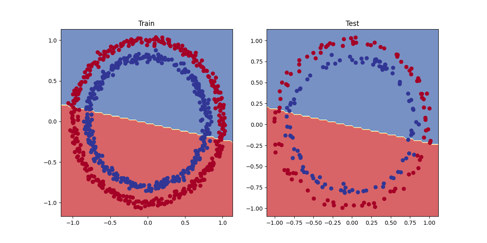
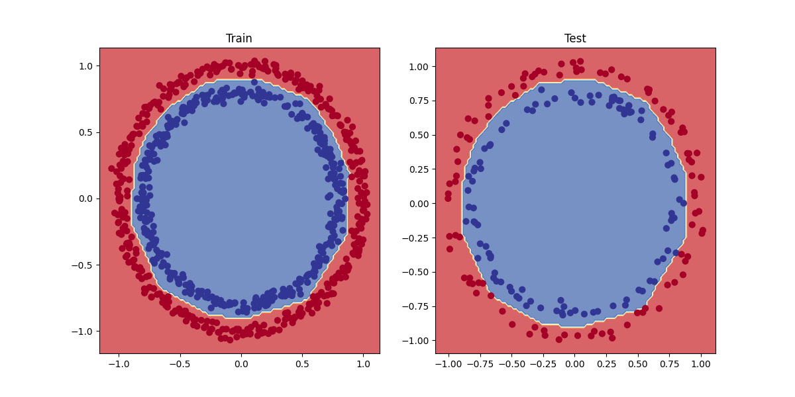

# 🧠 PyTorch Neural Networks

A small PyTorch project showing **binary classification** and **regression** with clear visual results.

---

## 📌 Overview
- Non-linear classification using neural networks
- Linear regression with synthetic data
- Visualized decision boundaries and predictions

---

## 📸 Screenshots

### Classification – Train
<p align="center">
  
</p>

### Classification – Test
<p align="center">
  
</p>

### Regression – Predictions
<p align="center">
  
</p>

---

## 🛠 Tech Stack
- Python
- PyTorch
- scikit-learn
- Matplotlib

---

## ▶ Run
```bash
pip install torch scikit-learn matplotlib
python main.py
